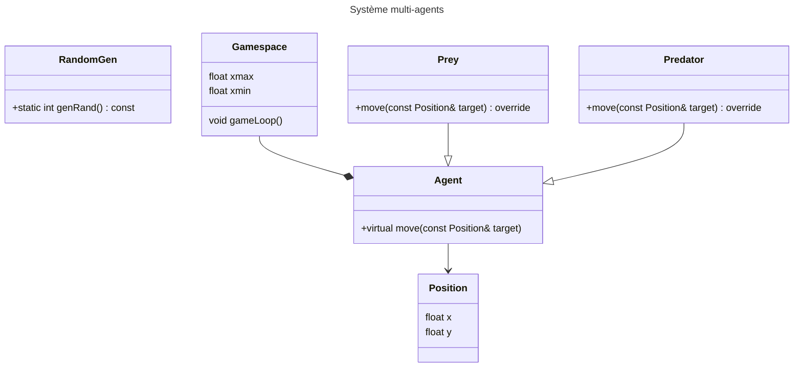

```mermaid
---
title: Système multi-agents
---
classDiagram

    class Position{
        float x
        float y
    }

    class RandomGen{
        +static int genRand() const
    }

    class Agent{
        +virtual move(const Position& target)
    }

    class Gamespace{
        float xmax
        float xmin

        void gameLoop()
    }

    Gamespace --* Agent

    Agent --> Position

    class Prey{
        +move(const Position& target) override
    }

    class Predator{
        +move(const Position& target) override
    }

    Prey --|> Agent
    Predator --|> Agent
```